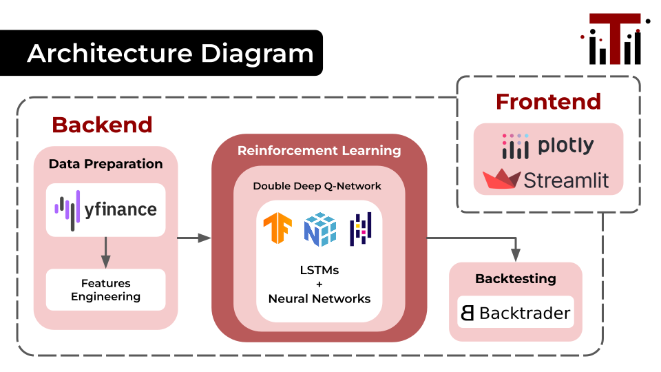

# DLWeek - ThorEMore

---
## Overview
ThorEMore is an AI-powered adaptive trading system using Reinforcement Learning integrated with LSTMs to predict market trends, optimize portfolios, and adapt to changing conditions. This model will focus on NASDAQ100 market index.

* Website: https://thoremore.streamlit.app/
* Slides: https://docs.google.com/presentation/d/1dGC1TDEB-zQeA7-Jm0YhEXNxFi76WEbceIRHIoKPaAU/edit?usp=sharing
* Demo: https://youtu.be/WrmupiFOZH4

### What Makes Our Approach Different?
**Adaptive Learning Models:**
* Long Short-Term Memory Networks (LSTMs): Recognizes sequential patterns in market data.
* Reinforcement Learning (RL): Continuously adapts to new market conditions.

**Optimization:**
* Layer Optimization: Reduce layer from 76,035 to 65,000 
* Training Time Optimization: Adaptive model of sector can be used with its sector 

## Data Preparation

We extracted data from [Yahoo Finance](https://finance.yahoo.com/) using [yfinance](https://yfinance-python.org/) API. The based data we got are `date`, `open`, `close`, `high`, `low`, `volume` for each stock in NASDAQ100. Moreover, we scraped stock's sector from [Wikipedia](https://en.wikipedia.org/wiki/Nasdaq-100).

### Features Engineering
Apart from market data, we did features engineering, which could be potentially important for our model.
* `dollar_vol_1m`: average of product of volume and close price in duration of 1 month 
* `return_{lag}d`: average daily return over lag days (in this project we use 1 day, 1 week, 1 month and 2 month)
* `return_{lag}d_{t}lag`: average daily return over lag days shift by t days
* `target_{t}d`: forward returns in t days
* Financial factors: Relative Strength Index (RSI), Bollinger Bands, Average True Range (ATR), Moving Average Convergence/Divergence (MACD)

## Modeling
Our model is based on Double Deep Q-Network (DDQN), which comprises of 3 hidden layers of size 256 and one LSTMs layer.

## Testing
We used backtesting to test our trading strategy by simulating how our model perform in the real market in historical data periods. For simplicity, we utilized [Backtrader](https://www.backtrader.com/), a Python library for backtesting.
